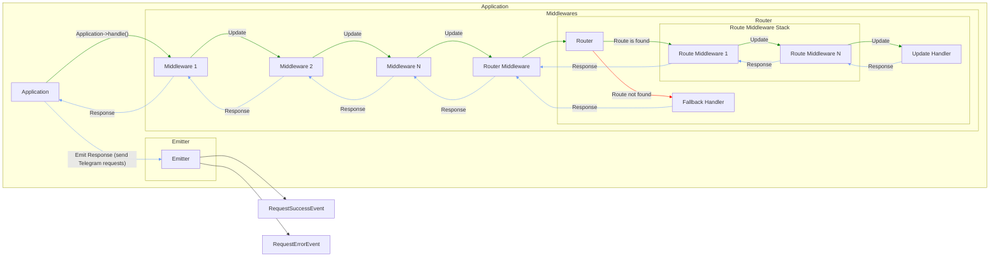

# Botasis Runtime Working Schema

In this section, we'll explore the fundamental steps of processing updates received from Telegram using Botasis Runtime.
We'll cover how to retrieve updates, create Update objects using the UpdateFactory, and handle these updates within 
your application. Here is an overview:

1. Your application receives a Telegram Update either by polling or via webhooks
2. Converting Telegram Update data into an `Update` object
3. Passing a Telegram Update object to an `Application`
    1. Passing Telegram Update through a common middleware stack forward
    2. Finding a route that suites the Telegram Update
    3. Executing a route middleware stack forward
    4. Executing a Telegram Update Handler
    5. Executing a route middleware stack backward
    6. Passing Telegram Update through a common middleware stack backward
    7. Emitting Telegram Requests which are set by executed Handler and Middlewares

## Working schema in details

### 1. Retrieving Updates

Before you can process updates from Telegram, you need a way to retrieve them. Telegram provides two primary methods
for getting updates: polling using the `getUpdates` method and setting up a webhook to receive updates asynchronously.

**Polling** involves making periodic requests to Telegram's servers to check for new updates. The `getUpdates` method
allows you to retrieve recent updates. It's very handy when you want to test your application locally.  
An example of getting updates with polling is available as a Symfony Console command [GetUpdatesCommand](../../src/Console/GetUpdatesCommand.php).

**Webhooks** enable your bot to receive updates instantly when they occur. This method is more efficient for real-time applications.

To set up a webhook, you'll need a public HTTPS URL where Telegram can send updates. Configure your bot to use this URL
using the `setWebhook` method. When an event occurs on your bot's chat, Telegram will send an HTTP POST request to your
webhook URL with the update data.  
An example of setting a webhook is available as a Symfony Console command [SetTelegramWebhookCommand](../../src/Console/SetTelegramWebhookCommand.php).

For detailed information on getting updates, refer to the [Telegram Bot API Documentation](https://core.telegram.org/bots/api#getting-updates).

### 2. Creating Update Objects

Once you have retrieved updates, you need to create Update objects, so the `Application` class can work with them.
The UpdateFactory class simplifies this process by providing a convenient way to create Update instances from the raw update data.

Here's how you can create an Update object using the UpdateFactory:

```php
// Create an Update object from raw update data and handle it

/** @var Botasis\Runtime\Update\UpdateFactory $updateFactory */
$update = $updateFactory->create($rawUpdateData);

/** @var \Botasis\Runtime\Application $application */
$application->handle($update);
```

### 3. Update Handling Inside Application

After creating Update objects, you should pass them to your application for processing. The `Application` class is responsible for
handling updates and executing the appropriate logic based on the update type and content.

Here is a graph describing what's going on after `$application->handle($update)` is called:



Let's revise this.
1. First of all, `Application` passes an incoming `Update` to a preconfigured middleware stack. This stack is defined
   by the `\Botasis\Runtime\Middleware\MiddlewareDispatcher::withMiddlewares()` method
2. The `Update` moves forward through the middleware stack (**the green line**)  
   _Note: the `RouterMiddleware` **MUST** be the last in the stack as it won't let `Update` to go further._
3. The `RouterMiddleware` passes the `Update` to the `Router`
4. The `Router` tries to find an appropriate Update Handler for the given `Update`.  
   _Note: every Update Handler should implement the `UpdateHandlerInterface`._
5. If an Update Handler is found, it handles the `Update` object. Otherwise, the `Router` throws a `RouteNotFound`
   exception, and a Fallback Handler handles it. Nevertheless, it implements the `UpdateHandlerInterface` too, so
   any Handler returns a `Response object`.
    1. Any Route can have its own middleware stack. If such a stack exists, the `Update` passes through it before
       it goes to the Update Handler.
6. The `Response` object passes the middleware stack (both of them) in the backwards direction (**the blue line**).
   Each middleware can modify this `Response` (actually not to modify, but create a new instance with some
   modifications, because `Response` is immutable).
7. Application passes the `Response` it got to the `Emitter`
8. If there are some `Request`s in the `Response`, `Emitter` sends them to the Telegram API
9. After each request an event is dispatched via PSR-14 `EventDispatcherInterface`. It is either `RequestSuccessEvent`
   or `RequestErrorEvent` depending on request result.

Next: [Quickstart with yiisoft/config and yiisoft/di](../getting-started/02-quick-start-yiisoft-config)
